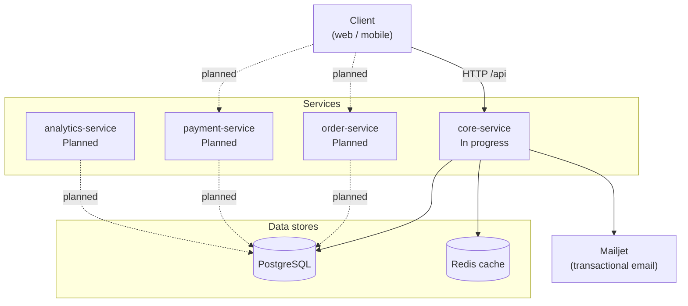

# Food Ordering App

A backend for a multi-restaurant food ordering platform, built as a set of
independent services. Customers browse restaurants and their branches, and order
products priced and stocked per branch. Restaurants manage their own staff and
permissions through a role-based access control system.

This repository is a monorepo: each service is a self-contained Node.js/TypeScript
application with its own dependencies, migrations and configuration.

## Services

| Service | Status | Description |
| --- | --- | --- |
| `core-service` | 🚧 In progress | Auth, users, restaurants, branches, products, addresses and RBAC |
| `order-service` | 📋 Planned | Cart, checkout and order lifecycle |
| `payment-service` | 📋 Planned | Payment processing and refunds |
| `analytics-service` | 📋 Planned | Reporting and business metrics |

## Architecture



## Module structure

Every module in `core-service/src/app/<module>/` follows the same layered shape.
Each layer only talks to the one directly beneath it.

```
routes.ts      HTTP method + path, middleware (authenticate, rbac)
controller/    request/response mapping, no business logic
service/       business logic, transactions, orchestration
repository/    database queries (Knex)
dto/           input validation and response shaping
entity/        classes representing database rows
errors.ts      module-specific error types
enums.ts       module-specific enums
```

Services are resolved through a DI container (`tsyringe`); tokens live in
`src/lib/di/tokens.ts` and bindings in `src/lib/di/containers.ts`.

### Modules in `core-service`

| Module | Responsibility |
| --- | --- |
| `auth` | Signup, login, JWT issuing, password reset via emailed OTP |
| `user` | User accounts and system roles |
| `restaurant` | Restaurant records |
| `branch` | Restaurant branches |
| `product` | Products, categories, and per-branch price/stock details |
| `addresses` | Customer delivery addresses |
| `rbac` | Roles, permissions, and restaurant membership |
| `health` | Liveness and database connectivity check |

Shared code sits outside `app/`:

- `src/lib/` — application wiring: `config` (zod-validated env), `di`, `knex`,
  `auth` (authenticate + rbac middleware), `cache`, `error` (central handler),
  `correlationId`, `http`, `logger`, `validation`, `email`
- `src/pkg/` — swappable infrastructure adapters behind interfaces:
  `cache` (Redis), `email` (Mailjet), `utils`

## Features

- JWT authentication with separate access and refresh tokens, delivered as cookies
- Password reset by one-time code sent over email (Mailjet)
- Role-based access control: system roles plus per-restaurant permissions,
  enforced by an `rbac({ resource, action })` middleware with system-admin bypass
- Permission lookups cached in Redis
- Multi-restaurant and multi-branch data model, with product price, stock and
  availability tracked per branch
- A database trigger that creates `product_branch_details` rows automatically for
  every branch when a product is added
- Request correlation IDs for traceable logs
- Centralised error handling with typed, module-scoped errors
- Environment validated with zod at startup, so a bad config fails fast
- `helmet` and configurable CORS

## Tech stack

| Area | Choice |
| --- | --- |
| Runtime | Node.js, TypeScript |
| HTTP | Express 5 |
| Database | PostgreSQL via Knex (query builder + migrations) |
| Cache | Redis via ioredis |
| DI | tsyringe |
| Validation | zod (environment), class-validator / class-transformer (DTOs) |
| Auth | jsonwebtoken, bcrypt |
| Email | Mailjet |
| Security | helmet, cors, cookie-parser |
| Dev tooling | tsx, eslint, prettier |

## Getting started

### Prerequisites

- Node.js 20 or newer
- PostgreSQL 14 or newer, with an empty database created
- Redis 6 or newer

### 1. Install

```bash
git clone https://github.com/dodmedhat6-glitch/foodOrderingApp.git
cd foodOrderingApp/core-service
npm install
```

### 2. Configure the environment

```bash
cp .env.example .env
```

Then edit `core-service/.env` and fill in your database password, database name,
JWT secrets and Mailjet credentials. Every variable is validated at startup, so
the server refuses to boot with an incomplete file rather than failing later.

### 3. Run migrations

From the `core-service` directory:

```bash
npm run knex -- migrate:latest
```

Other Knex commands work the same way, for example `npm run knex -- migrate:list`
or `npm run knex -- migrate:rollback`. The config is not a plain `knexfile.js`:
`knexfile.ts` at the service root re-exports `src/lib/knex/knexConfig.ts`, which
builds the connection from the validated environment.

The same command also works from the repository root, which proxies to
`core-service`.

### 4. Start the development server

```bash
npm run dev
```

The API is served under the `/api` prefix on the port from `PORT` (3000 by default).

### 5. Check it is working

```bash
curl http://localhost:3000/api/health
```

A healthy service returns `{"status":"ok"}` after a successful database round-trip.
If the database is unreachable it responds `500` with `Database connection failed`.

## Scripts

Run from `core-service/`:

| Script | Command | Description |
| --- | --- | --- |
| `dev` | `npm run dev` | Start the server with `tsx watch` and live reload |
| `build` | `npm run build` | Type-check and compile TypeScript to `dist/` |
| `start` | `npm start` | Run the compiled server from `dist/` |
| `knex` | `npm run knex -- <cmd>` | Run any Knex CLI command against `knexfile.ts` |

From the repository root:

| Script | Command | Description |
| --- | --- | --- |
| `knex` | `npm run knex -- <cmd>` | Proxy to the `core-service` Knex CLI |

## Known issues

**Migration ordering on a fresh database.** Knex runs migrations in filename
order, and `20260224200000_create_products_tables.ts` is dated earlier than the
migrations that create the tables it references. It declares foreign keys to
`restaurants` (created in `20260827000435_restaurant_tabel.ts`) and to
`restaurant_branches` (created in `20260831130551_create_restaurant_branches_tabel.ts`),
so on an empty database `migrate:latest` stops on the first migration with
`relation "restaurants" does not exist`.

Until the file is renamed, set up a fresh database by running the earlier
migrations one at a time up to `20260831130551`, then the products migration, and
finally the rest:

```bash
npm run knex -- migrate:up 20260819090202_user_table.ts
# ... continue up through 20260831130551_create_restaurant_branches_tabel.ts
npm run knex -- migrate:up 20260224200000_create_products_tables.ts
npm run knex -- migrate:latest
```

Renaming the migration to sort correctly is the real fix, but it requires
updating the `name` column in the existing `knex_migrations` table on every
database that has already run it, so it is deliberately left for a separate
change.

## Documentation

- [Development workflow](docs/development-workflow.md) — how a feature is built,
  layer by layer.

## Roadmap

- [x] Project scaffold and layered module structure
- [x] User accounts and system roles
- [x] JWT authentication with access and refresh tokens
- [x] Password reset over email with one-time codes
- [x] Restaurants and branches
- [x] Products with per-branch price, stock and availability
- [x] Customer addresses
- [x] Role-based access control with Redis-cached permissions
- [x] Health check endpoint
- [ ] Fix the products migration ordering
- [ ] Automated test suite
- [ ] API documentation (OpenAPI)
- [ ] Dockerised local setup
- [ ] `order-service`: cart, checkout and order lifecycle
- [ ] `payment-service`: payments and refunds
- [ ] `analytics-service`: reporting and metrics
