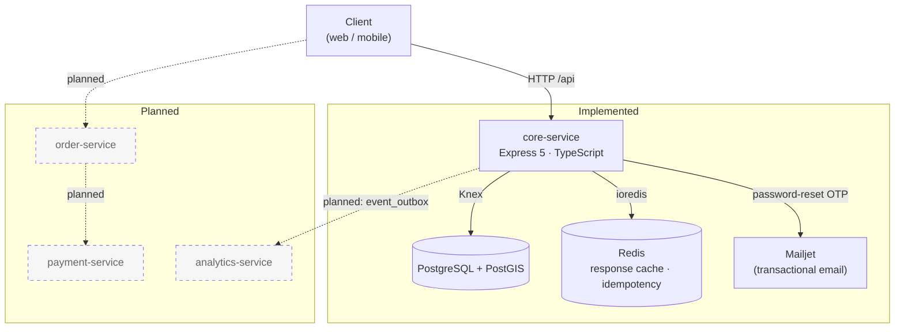

# Food Ordering Platform

A backend for a multi-restaurant food ordering platform. Restaurants register,
open branches, manage a product catalogue whose price and stock vary per branch,
and give their staff scoped permissions. Customers browse restaurants, find
branches that deliver to their location, and manage delivery addresses.

The backend is written in Node.js and TypeScript on Express 5, with PostgreSQL
(plus PostGIS) as the primary store and Redis for caching and idempotency. The
repository is a monorepo: each service is meant to be a self-contained
application with its own dependencies, migrations and configuration.

**Current status:** `core-service` is the only service with code. It covers
authentication, users, restaurants, branches, products, addresses and RBAC, and
is still in progress: some modules are complete end to end, others have their
service and data layers written but are not yet exposed over HTTP (see
[What is implemented](#what-is-implemented)). `order-service`, `payment-service`
and `analytics-service` are planned and do not exist in the repository yet. The
project is being built incrementally toward a service-oriented architecture.

## Engineering Highlights

- **Layered architecture:** every module follows Routes → Controllers →
  Services → Repositories, and each layer has one job.
- **Dependency injection with `tsyringe`:** controllers, services and
  infrastructure adapters are bound to symbol tokens and resolved from a single
  container.
- **JWT authentication** with separate access and refresh tokens, each signed
  with its own secret and delivered in `httpOnly` cookies.
- **RBAC:** system roles, plus restaurant-scoped roles whose permissions are
  stored in the database as `resource:action` pairs and checked by middleware.
- **Branch-level authorization:** staff can be limited to specific branches,
  and the assignments are carried in the token.
- **Geospatial search:** a PostGIS `geography` column with a GIST index finds
  active branches whose delivery radius covers a given point (`ST_DWithin`).
- **Multi-restaurant / multi-branch data model:** product price, stock and
  availability are stored per branch, and a PostgreSQL trigger keeps them in
  step with new products.
- **Redis:** a response-cache middleware and an idempotency-key middleware.
- **Transactional writes:** a restaurant sign-up creates the user, the
  restaurant and the owner membership in one Knex transaction.
- **Cursor-based pagination and whitelisted query filters** (`eq`, `gt`, `lt`,
  `gte`, `lte`, `in`, `like`).
- **Swappable infrastructure:** cache and email sit behind interfaces
  (`ICacheProvider`, `IEmailProvider`), with Redis and Mailjet adapters.
- **Observability and safety:** per-request correlation IDs, structured JSON
  logging, centralized typed error handling, environment validated with zod at
  startup, `helmet`, configurable CORS and graceful shutdown.

## What Is Implemented

| Area | Status | What is implemented |
| --- | --- | --- |
| Authentication | Implemented ⚠️ | Register (customer or restaurant owner), login, refresh, staff invite acceptance. bcrypt password hashing, JWT access and refresh tokens in `httpOnly` cookies. Blocked on a fresh database by a schema mismatch (see [Known Issues](#known-issues)). |
| Password reset | Implemented | 6-digit OTP generated with `crypto.randomInt`, stored as a SHA-256 hash with a 10-minute expiry, sent through Mailjet. The request endpoint requires an `Idempotency-Key` header and does not reveal whether an account exists. |
| Users | Implemented | `GET /api/user/me`, `PATCH /api/user/update-user`. |
| Restaurants | Implemented | Created as `pending` during owner sign-up. Public listing with cursor pagination and filters, owner updates, status changes by a system admin. |
| Branches | Implemented | Create/update (owner), status and commission changes (system admin), list by restaurant, PostGIS nearby search cached in Redis. |
| RBAC | Implemented ⚠️ | Roles, permissions, restaurant members, member-branch assignments. Member create/list/update/delete, branch reassignment, role-permission lookup. Invitation emails are not sent yet, and the system-admin bypass in `rbac()` has a bug. |
| Permission cache | Implemented | In-process cache (`Map`, 1-hour TTL) of role → permissions, so the database is queried at most once an hour per role and process. |
| Response cache / idempotency | Implemented | Redis-backed `withCache()` and `idempotency()` middleware. |
| Products | Partial | Categories, products, per-branch details, the auto-populating trigger, service and repository layers. Routes are defined but **not mounted** in `src/routes.ts`. |
| Addresses | Partial | Full CRUD service with single-default-address handling. Routes are defined but **not mounted**, and the insert does not match the table schema. |
| Health checks | Implemented | `GET /api/health` runs a `select 1` against PostgreSQL. |
| Event outbox / API keys | Schema only | `event_outbox` and `api_keys` tables exist as groundwork for service-to-service communication. No code uses them yet. |
| Automated tests | Not started | No test suite yet. |
| `order-service` | Planned | Cart, checkout and order lifecycle. |
| `payment-service` | Planned | Payment processing and refunds. |
| `analytics-service` | Planned | Reporting and business metrics. |

## Architecture



Solid boxes and arrows exist in the code today. Dashed ones show the intended
direction. The `event_outbox` table is already in the schema, but nothing
publishes from it yet.

## Core Service Architecture

Each module under `core-service/src/app/<module>/` is split into layers, and
each layer calls only the one directly below it:

```
Route        routes.ts     HTTP method + path, middleware chain (authenticate, rbac, cache)
  ↓
Controller   controller/   validates the body into a DTO, calls the service, shapes the response
  ↓
Service      service/      business rules, ownership checks, transactions
  ↓
Repository   repository/   Knex queries, maps snake_case rows to entity classes
  ↓
PostgreSQL
```

Alongside the layers, `dto/` holds `class-validator` input classes, `entity/`
holds classes that represent table rows, and `errors.ts` / `enums.ts` hold
module-specific errors and enums.

**Dependency injection.** Tokens are `Symbol.for(...)` values in
`src/lib/di/tokens.ts`. `src/lib/di/containers.ts` registers every controller
and service as a singleton and binds the infrastructure adapters as instances:
`CacheProvider` (Redis) and `EmailProvider` (Mailjet). Classes are marked
`@injectable()` and receive dependencies through `@inject(token)`. For example,
`AuthService` gets `UserService`, `RestaurantService`, `MemberService` and the
`IEmailProvider` through its constructor. Route files resolve their controller
from the container, and the middleware resolves the cache provider the same
way, so changing an adapter only touches the container.

## Core Modules

| Module | Responsibility |
| --- | --- |
| `auth` | Registration (customer / restaurant owner), login, token refresh, password reset by OTP, staff invite acceptance, email template |
| `user` | User accounts, system roles, profile read/update |
| `restaurant` | Restaurant records, lifecycle status (`pending`, `active`, `suspended`, `disable`), paginated public listing |
| `branch` | Branches with location, opening hours, currency, delivery radius and commission. Nearby search |
| `product` | Categories, products, and per-branch price / stock / availability |
| `addresses` | Customer delivery addresses with a single default address per user |
| `rbac` | Roles, permissions, restaurant members, member-branch assignments, permission cache |
| `health` | Database connectivity check |

## Shared Infrastructure

`src/lib/` holds application wiring:

| Path | Purpose |
| --- | --- |
| `config/env.ts` | Loads `.env` and validates it with a zod schema. Exposes a typed `env` object. |
| `di/` | `tsyringe` tokens and container bindings |
| `knex/` | Knex config (shared by the app and the Knex CLI) and the database instance |
| `auth/` | `authenticate`, `rbac()`, `requireRestaurantMember()`, `requireBranchAccess()`, cookie helpers |
| `cache/` | Redis provider instance and the `withCache()` response-cache middleware |
| `Idempotency/` | `idempotency()` middleware that stores responses under the `Idempotency-Key` header |
| `error/` | `AppError` (status code + operational flag) and the central error handler |
| `correlationId/` | Assigns a UUID to each request and returns it in `X-Correlation-ID` |
| `logger/` | Structured JSON logger |
| `http/` | Response envelope helpers, cursor pagination and query-filter parsing |
| `validation/` | `validateBody()` built on `class-transformer` + `class-validator` (whitelisting) |
| `email/` | Mailjet provider instance |

`src/pkg/` holds infrastructure adapters behind interfaces, with no
application dependencies:

- `cache/`: `ICacheProvider` and a `RedisCacheProvider` (ioredis)
- `email/`: `IEmailProvider` and a Mailjet provider
- `utils/`: time-unit helpers

## Key Backend Features

### Authentication

- Passwords are hashed with bcrypt.
- Login and registration issue an access token and a refresh token, signed with
  separate secrets and expiries (`ACCESS_EXPIRATION`, `REFRESH_EXPIRATION`).
- Both tokens are set as `httpOnly` cookies (`secure` in production). The
  refresh cookie is scoped to `/api/auth/refresh`, so the browser sends it only
  to that endpoint.
- The token payload carries the user's system role. Restaurant staff tokens also
  carry their restaurant, restaurant role and assigned branches, so
  authorization checks do not need a database lookup per request.
- `POST /api/auth/refresh` verifies the refresh token and issues a new access
  token. The refresh token itself is not rotated.
- Password reset sends a 6-digit OTP by email. Only its SHA-256 hash is stored,
  and it expires after 10 minutes.

### RBAC

Authorization has two levels.

1. **System roles** on the user: `system_admin`, `restaurant_user`, `customer`,
   `delivery_agent`.
2. **Restaurant roles** for `restaurant_user` accounts. A user joins a
   restaurant through `restaurant_members` with a role. `role_permissions` maps
   roles to `(resource, action)` permissions such as `core:product:create`.
   `member_branches` limits a member to specific branches.

Routes compose three middleware:

```ts
branchRouter.patch('/branches/:branchId',
    authenticate,                                      // verify access-token cookie
    requireBranchAccess('branchId'),                   // branch is in the token's branchIds
    rbac({resource: "core:branch", action: 'update'}), // role has the permission
    branchController.update
);
```

- `requireRestaurantMember` and `requireBranchAccess` let a `system_admin`
  through and check every other user against the restaurant or branches in
  their token.
- `rbac()` looks up the permission set for the user's restaurant role through
  `PermissionsCashService`. This is an in-process cache with a 1-hour TTL, so
  each process queries the database at most once an hour per role.
- On top of the middleware, services enforce ownership (for example, only the
  restaurant owner or a system admin can update a branch). Status changes on
  restaurants and branches are restricted to system admins.
- Owners are created automatically when they sign up. Other staff are invited:
  a user account and an `inactive` membership are created with branch
  assignments and an OTP. `POST /api/auth/accept-invite` then sets the password
  and activates the membership.

### Multi-Branch Product Model

A product belongs to a restaurant, but its commercial data belongs to a branch.
`product_branch_details` holds `price`, `stock` and `is_available` per
`(branch_id, product_id)`, with a unique constraint on the pair. The same burger
can cost and stock differently in each branch, or be unavailable in one of them.

The `trg_product_after_insert` trigger (`fn_insert_product_branch_details`)
runs after each product insert. It creates a row for every existing branch of
that restaurant, with price `0`, stock `0` and `is_available = false`. A new
product therefore starts hidden everywhere until a branch prices and enables
it. The trigger does not run when a branch is added, so branches created later
get no rows for existing products.

### Observability and Reliability

- **Correlation IDs:** every request gets a UUID, returned in the
  `X-Correlation-ID` response header and attached to error logs.
- **Centralized errors:** modules throw `AppError` instances with an HTTP
  status. The global handler logs every error and returns operational errors as
  is. Anything unexpected becomes a generic `500`, so internal details do not
  leak. All responses use the same `{ success, data, meta? }` envelope.
- **Logging:** a structured JSON logger (level, message, timestamp, metadata)
  writes to stdout.
- **Health check:** `GET /api/health` runs a database round-trip.
- **Environment validation:** the zod schema runs at import time. A missing
  required variable stops the process at startup, not on the first request
  that needs it.
- **Graceful shutdown:** on `SIGINT`/`SIGTERM` the HTTP server stops accepting
  connections, then the Knex pool is closed.

## Tech Stack

| Area | Technology |
| --- | --- |
| Runtime | Node.js |
| Language | TypeScript (strict mode) |
| HTTP | Express 5 |
| Database | PostgreSQL with PostGIS |
| Database access | Knex (query builder + migrations), `pg` driver |
| Cache | Redis via ioredis |
| DI | tsyringe, reflect-metadata |
| Validation | zod (environment), class-validator + class-transformer (request DTOs) |
| Authentication | jsonwebtoken, bcrypt, cookie-parser |
| Email | Mailjet (`node-mailjet`) |
| Security | helmet, cors |
| Development | tsx (watch mode), tsc |

## Getting Started

### Prerequisites

- Node.js 20 or newer
- PostgreSQL 14 or newer with the **PostGIS** extension available. The branches
  migration runs `CREATE EXTENSION IF NOT EXISTS postgis`, so the database user
  needs permission to create it.
- Redis 6 or newer
- A Mailjet account to actually send password-reset emails. Any non-empty
  values pass validation if you only need the server to boot.

### 1. Clone and install

```bash
git clone https://github.com/dodmedhat6-glitch/foodOrderingApp.git
cd foodOrderingApp/core-service
npm install
```

### 2. Configure the environment

```bash
cp .env.example .env
```

Edit `core-service/.env` and fill in the database password and name, the two
JWT secrets and the Mailjet credentials. Every variable is documented in
`.env.example` and validated at startup.

### 3. Create an empty database and run migrations

From `core-service/`:

```bash
npm run knex -- migrate:latest
```

On a **fresh** database this currently fails on the first migration. Use the
workaround under [Known Issues](#known-issues). Other Knex commands work the
same way (`npm run knex -- migrate:list`, `npm run knex -- migrate:rollback`).
The same `npm run knex -- <cmd>` also works from the repository root.

### 4. Start the development server

```bash
npm run dev
```

The API is served under `/api` on `PORT` (default `3000`).

### 5. Check it is working

```bash
curl http://localhost:3000/api/health
# {"success":true,"data":{"status":"ok"}}
```

If the database is unreachable, the endpoint responds `500` with
`{"success":false,"data":{"message":"Database connection failed"}}`.

## Scripts

From `core-service/`:

| Script | Description |
| --- | --- |
| `npm run dev` | Run `src/server.ts` with `tsx watch` (reloads on change) |
| `npm run build` | Type-check and compile to `dist/` with `tsc` |
| `npm start` | Run the compiled server from `dist/server.js` |
| `npm run knex -- <cmd>` | Run a Knex CLI command against `knexfile.ts` |

From the repository root:

| Script | Description |
| --- | --- |
| `npm run knex -- <cmd>` | Proxy to the `core-service` Knex CLI |

## Known Issues

These were found by running the service against a database built from the
migrations. They are listed so the current state is clear.

**Migration ordering on a fresh database.**
`20260224200000_create_products_tables.ts` has a timestamp earlier than the
migrations that create `restaurants` and `restaurant_branches`, which its
foreign keys reference. Knex runs migrations in filename order, so
`migrate:latest` on an empty database stops with
`relation "restaurants" does not exist`. Until the file is renamed, apply the
migrations up to the branches table first:

```bash
for m in 20260819090202_user_table.ts 20260819150824_password_reset_table.ts \
         20260819151315_customer_adresses_table.ts 20260821190000_expand_password_reset_otp_code.ts \
         20260827000435_restaurant_tabel.ts 20260831130551_create_restaurant_branches_tabel.ts \
         20260224200000_create_products_tables.ts; do
  npm run knex -- migrate:up "$m"
done
npm run knex -- migrate:latest
```

The long-term fix is to rename the migration so it sorts after its
dependencies. Databases that already ran it need their `knex_migrations` row
updated at the same time.

**Other open items:**

- **Schema drift:** the user repository reads and writes a `name` column, but
  the `users` migration defines `username`. Registration therefore fails on a
  freshly migrated database. The address insert also omits the `NOT NULL`
  `text` column. A new migration needs to align the schema with the code.
- **No seed data:** `roles`, `permissions` and `role_permissions` are empty
  after migration. Restaurant sign-up needs an `owner` role, so those rows must
  be inserted manually for now.
- **Unmounted routers:** `productRouter` and `customerAddressRouter` exist but
  are not registered in `src/routes.ts`. Also, `PATCH /products/:id` uses
  `requireBranchAccess('branchId')` on a path that has no `branchId` parameter.
- **System-admin bypass in `rbac()`:** the condition is inverted
  (`!allowSystemAdmin && …`), so system admins get `403` on routes guarded by
  `rbac()`.
- **Staff invitations:** the invite OTP is logged to the console and not
  emailed. `createMember` returns errors from its transaction instead of
  throwing them.
- **Error logs include the request body,** which can contain passwords. Sensitive
  fields should be redacted.

## Documentation

- [Development workflow](docs/development-workflow.md): how a feature is built
  layer by layer, from migration to route.

## Roadmap

### Core Service

Completed:

- [x] Layered module structure with `tsyringe` DI
- [x] User accounts and system roles
- [x] JWT authentication with access and refresh tokens in `httpOnly` cookies
- [x] Password reset with hashed, expiring email OTPs
- [x] Restaurants with lifecycle status and paginated listing
- [x] Branches with PostGIS nearby search
- [x] RBAC: restaurant roles, permissions, members, branch scoping
- [x] Product data model with per-branch details and the auto-populating trigger
- [x] Redis response cache and idempotency middleware
- [x] Correlation IDs, structured logging, centralized errors, env validation
- [x] Health check endpoint

Remaining:

- [ ] Fix migration ordering and the `users` / `customer_addresses` schema drift
- [ ] Seed roles and permissions
- [ ] Mount the product and address routes
- [ ] Fix the system-admin bypass in `rbac()`
- [ ] Send invitation emails. Make reset OTPs single-use by checking
      `consumed_at`.
- [ ] Rotate refresh tokens and allow revoking them
- [ ] Redact sensitive fields in logs. Use the incoming correlation ID when one
      is provided.
- [ ] Automated test suite (unit + integration against PostgreSQL)
- [ ] OpenAPI documentation
- [ ] Dockerized local setup (PostgreSQL + PostGIS, Redis)

### Additional Services

None of these exist yet.

- [ ] `order-service`: cart, checkout and order lifecycle, reading branch
      prices and availability from `core-service`
- [ ] `payment-service`: payment processing and refunds
- [ ] `analytics-service`: reporting and business metrics, fed by events
      published from the `event_outbox` table

## Project Direction

The project is being built one service at a time. `core-service` comes first
because every other service depends on its identity, restaurant, branch and
catalogue data. It already has some groundwork for a service-oriented setup: the
modules have clear boundaries, the infrastructure sits behind interfaces, and
the `event_outbox` and `api_keys` tables are in the schema. The next steps are
to close the known issues and add tests, then to start `order-service` as the
first separate service. The platform is not yet a set of microservices, and
this README does not claim that it is.
